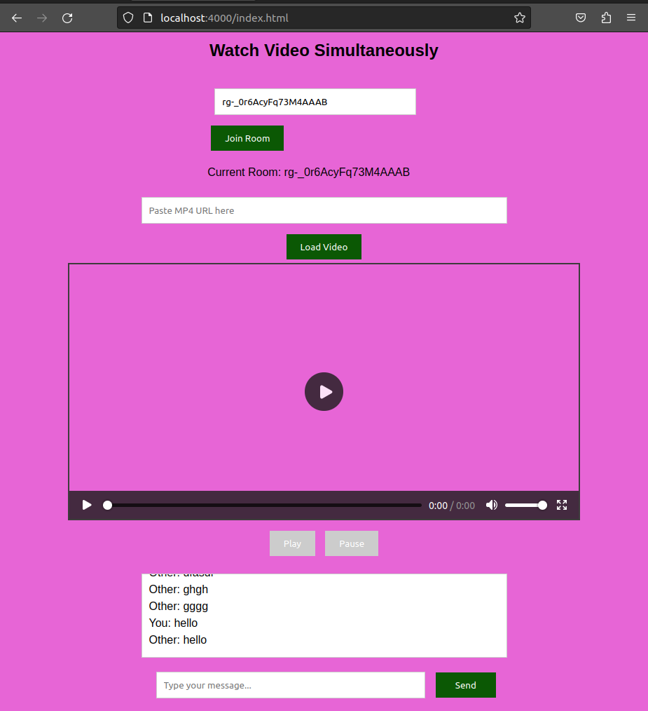
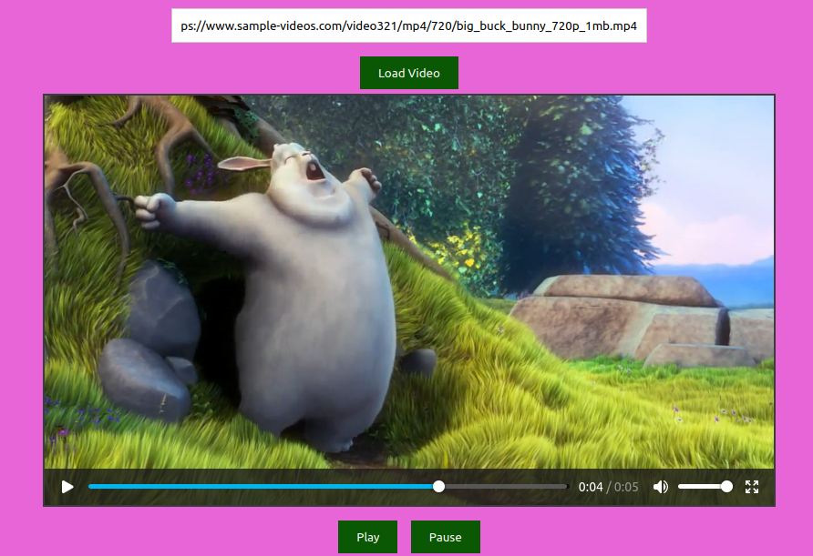

# OUR SCREEN


## Basic Details
### Team Name: Techie trios


### Team Members
- Member 1: Sreelakshmi S L - GEC KOZHIKODE
- Member 2: Carmel Antony - GEC KOZHIKODE
- Member 3: Angelin George - GEC KOZHIKODE
### Hosted Project Link
https://ourscreen.onrender.com/

### Project Description
An online website for watching videos and chat simultaneously at different places.

### The Problem solving
Our website solves the problem of not connecting people of different regions.

### The Solution
connect people simultaneously and entertainment.

## Technical Details
### Technologies/Components Used
For Software:
- html
- ExpressJS
- Socket.io
- VS CODE

### Implementation
For Software:
# Installation
1. you need nodejs and npm installed on your pc
2. Install neccasarry packages
```bash
npm i

```
3. run Develpment env
```
npm run dev
```

# Run
```
npm run start
```

### Project Documentation
For Software:

# Screenshots 



*Socket.io room chat and video playing room*


### Project Demo

# Additional Demos
https://ourscreen.onrender.com
[video](<../../Videos/Screencasts/Screencast from 08-02-25 05:37:08 PM IST.webm>)

## Team Contributions
- Member 1: Sreelakshmi S L - GEC KOZHIKODE
- Member 2: Carmel Antony - GEC KOZHIKODE
- Member 3: Angelin George - GEC KOZHIKODE

---
Made with ❤️ at TinkerHub